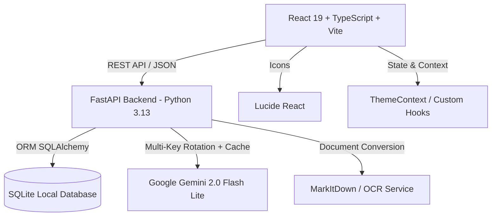

# BÁO CÁO TỔNG QUAN DỰ ÁN & HƯỚNG DẪN THIẾT LẬP AGENT REVIEW CODE
**Dự án:** TOEIC Local Study Web App (Hệ thống Luyện thi & Học TOEIC Tự động)  
**Phiên bản:** 1.0.0 (Production Ready)  
**Ngày cập nhật:** 19/08/2026  

---

## 1. TỔNG QUAN DỰ ÁN (PROJECT OVERVIEW)

### 1.1 Mục tiêu dự án
Xây dựng ứng dụng web luyện thi TOEIC Reading & Listening hoàn chỉnh chạy nội bộ (Local-first), hỗ trợ học viên từ mất gốc đến nâng cao với sự trợ giúp của AI (Google Gemini 2.0 Flash Lite), thuật toán ngắt quãng SRS (Spaced Repetition System), và kho đề thi chuẩn ETS/Hacker/YBM.

### 1.2 Kiến trúc công nghệ (Tech Stack)



- **Frontend:**
  - **Framework:** React 19 (`react`, `react-dom`)
  - **Bundler:** Vite
  - **Ngôn ngữ:** TypeScript 5.8+ (Cấu hình `strict: true`)
  - **Routing:** `react-router-dom` v7
  - **Icon:** `lucide-react` (Độc quyền 100%, không pha trộn inline SVG)
  - **Giao diện:** Modern Glassmorphism, Clean UI, Dark/Light Mode, Theme Switcher, 100% không dùng raw emoji (thay thế bằng icon vector chuẩn).

- **Backend:**
  - **Framework:** FastAPI (Python 3.13)
  - **Cơ sở dữ liệu:** SQLite + SQLAlchemy ORM (Hỗ trợ migrate tự động trên startup)
  - **Validation & Serialization:** Pydantic v2 (`model_validate`, `model_dump`)
  - **AI Integration:** Google Gemini 2.0 Flash Lite REST API với cơ chế **Multi-Key Rotation**, **Exponential Backoff**, và **SQLite Cache 0-Token**.
  - **Tài liệu & OCR:** Microsoft MarkItDown, PyPDF2, pdfplumber, pytesseract.

---

## 2. CẤU TRÚC THƯ MỤC DỰ ÁN (PROJECT ARCHITECTURE)

```
d:\TOIEC Web/
├── AGENTS.md                   # Bộ Dev Rules chuẩn cho Frontend (React 19, TypeScript)
├── dev-rules/                  # Script & bộ quy tắc audit tự động cho Frontend
│   ├── audit.bat               # Trình chạy audit Frontend trên Windows
│   └── audit-rules.sh          # Trình chạy bash cho Frontend
├── dev_rules_be/               # Bộ quy tắc & công cụ audit Backend
│   ├── audit.bat               # Trình chạy audit Backend
│   ├── audit_rules.py          # Script phân tích tĩnh 9 quy tắc Python/FastAPI
│   └── python-dev-rules/       # Hướng dẫn chi tiết Dev Rules Python
├── frontend/                   # Ứng dụng Frontend React 19
│   ├── src/
│   │   ├── api/                # API client (axios / fetch services)
│   │   ├── components/         # UI Components độc lập (1 component / file)
│   │   ├── constants/          # Hằng số thuần, không phụ thuộc props/state
│   │   ├── context/            # Context API (ThemeContext)
│   │   ├── hooks/              # Custom hooks nghiệp vụ (Timer, Session, Exam taking)
│   │   ├── pages/              # Các trang giao diện chính (Dashboard, Exam, Roadmap, Flashcard, v.v.)
│   │   ├── types/              # TypeScript interfaces chuẩn hóa
│   │   └── utils/              # Pure functions (tính điểm TOEIC, format thời gian, helper)
│   └── package.json
├── backend/                    # Ứng dụng Backend FastAPI
│   ├── CLAUDE.md               # Bộ Dev Rules chuẩn cho Backend FastAPI
│   ├── app/
│   │   ├── main.py             # Entrypoint FastAPI, CORS, Mount static files
│   │   ├── db.py               # Kết nối SQLite & SessionLocal
│   │   ├── models.py           # SQLAlchemy Database Models (10+ bảng)
│   │   ├── schemas.py          # Pydantic v2 Request/Response Schemas
│   │   ├── routers/            # 10 API Routers phân tách theo tính năng
│   │   │   ├── documents.py    # Xử lý upload tài liệu & background OCR
│   │   │   ├── textbooks.py    # Quản lý giáo trình có sẵn, thi thử & chấm điểm
│   │   │   ├── curriculum.py   # Lộ trình học cá nhân hóa, Placement test, AI Bài giảng
│   │   │   ├── questions.py    # Quản lý kho câu hỏi Part 5, 6, 7
│   │   │   ├── vocabulary.py   # Tra cứu ngữ cảnh & Album từ vựng theo chủ đề
│   │   │   ├── flashcards.py   # Thuật toán ôn tập ngắt quãng SRS (SuperMemo)
│   │   │   ├── quiz.py         # 4 chế độ Quiz (Nghĩa, Nghe TTS, Gõ từ, Đồng nghĩa)
│   │   │   ├── dashboard.py    # Thống kê tiến độ, tốc độ làm bài & thời gian học
│   │   │   ├── grammar.py      # Thẻ ôn nhanh ngữ pháp 0-token
│   │   │   └── ai_generator.py # Sinh câu hỏi tương đương & giải thích chuyên sâu
│   │   └── services/           # Business logic & AI Processing layer
│   └── requirements.txt
└── book/                       # Dữ liệu giáo trình, mindmap & hình ảnh bài học
```

---

## 3. CÁC TÍNH NĂNG ĐÃ HOÀN THIỆN (KEY FEATURES)

| STT | Tính năng | Mô tả chi tiết |
|---|---|---|
| 1 | **Kho giáo trình có sẵn (Textbook Catalog)** | 100+ đề thi ETS 2020-2024, Hacker, YBM, Xanh Cam. Hỗ trợ thi 75 phút hoặc luyện tập tự do. |
| 2 | **Chấm điểm TOEIC chuẩn (5 - 495)** | Thuật toán quy đổi điểm thô ra điểm scaled chuẩn quốc tế, phân tích số câu đúng từng Part 5, 6, 7. |
| 3 | **AI Giải thích & Nhắc công thức (Gemini 2.0)** | Phân tích chi tiết từng phương án A/B/C/D, bẫy thường gặp (*Common Trap*), dịch câu song ngữ tự nhiên, tự động lưu Cache SQLite để tái sử dụng với độ trễ 0ms. |
| 4 | **Lộ trình cá nhân hóa (Curriculum Engine)** | Bài kiểm tra đầu vào 25 câu (*Placement Test*), bản đồ năng lực (*Mastery Map*), bài giảng AI chi tiết theo từng chủ điểm ngữ pháp với ví dụ từ đề thi thật. |
| 5 | **Ôn tập từ vựng ngắt quãng (SRS Flashcard)** | Thuật toán SuperMemo SM-2 tự động tính toán thời gian lặp lại tối ưu theo cấp độ ghi nhớ (Levels 1-5). |
| 6 | **Đa dạng chế độ Quiz** | 4 chế độ luyện tập: Trắc nghiệm nghĩa tiếng Việt, Nghe phát âm TTS, Gõ nghĩa ngược (*Reverse Typing*), và Cặp từ đồng nghĩa (*Synonyms*). |
| 7 | **Bảng phân tích Dashboard & Tốc độ làm bài** | Đo lường thời gian làm bài trung bình từng Part (Part 5: mục tiêu 20s, Part 6: 37s, Part 7: 60s), chuỗi ngày học liên tục (Streak), và biểu đồ điểm yếu ngữ pháp. |
| 8 | **Xử lý tài liệu OCR & MarkItDown** | Upload file PDF đề thi mới, xử lý đa luồng chạy nền (*BackgroundTasks*) không gây block server. |

---

## 4. QUY CHUẨN MÃ NGUỒN & HỆ THỐNG AUDIT (DEV RULES)

Dự án áp dụng bộ quy chuẩn nghiêm ngặt cho cả 2 tầng Frontend và Backend:

### 4.1 Quy chuẩn Frontend (`AGENTS.md`)
1. **One file = one component**: Không khai báo helper component trong cùng file.
2. **Icons & Buttons**: Sử dụng 100% `lucide-react`, không dùng raw inline SVG, không dùng raw unicode emojis trong mã nguồn giao diện.
3. **TypeScript**: Bắt buộc sử dụng `interface` thay vì `type` cho cấu trúc đối tượng; đặt tên Props theo mẫu `<ComponentName>Props`.
4. **React 19**: Sử dụng `SyntheticEvent<HTMLFormElement>` thay cho `FormEvent`.
5. **Giới hạn độ dài**: Giữ file component dưới 300 dòng; tách nhỏ thành sub-views khi vượt quá giới hạn.
6. **Code Style**: Bắt buộc có dòng trống trước `return` và giữa các khối logic riêng biệt.

### 4.2 Quy chuẩn Backend (`backend/CLAUDE.md`)
1. **Logging**: 100% sử dụng `logging.getLogger(__name__)`, cấm tuyệt đối `print()` trong code xử lý.
2. **Type Hints**: Bắt buộc khai báo kiểu trả về `-> ReturnType` cho toàn bộ function và API endpoint.
3. **Dependency Injection**: Áp dụng chuẩn FastAPI hiện đại `Annotated[Session, Depends(get_db)]`.
4. **Pydantic v2**: Sử dụng `model_dump()`, `model_validate()`, không sử dụng API v1 cũ (`.dict()`, `.json()`).
5. **Timezone**: Sử dụng `datetime.now(timezone.utc)` thay cho `datetime.utcnow()` lỗi thời.
6. **Bảo mật truy vấn**: Không sử dụng f-string ghép câu lệnh SQL thô; sử dụng truy vấn tham số hóa SQLAlchemy ORM.

---

## 5. HƯỚNG DẪN THIẾT LẬP AGENT REVIEW CODE (AGENT REVIEW SETUP)

Để thiết lập bất kỳ AI Agent nào (Antigravity IDE, Claude Code, Cursor, GitHub Copilot, Codex, CI/CD Pipeline) tự động review và kiểm soát chất lượng mã nguồn dự án, thực hiện theo các bước sau:

### 5.1 Cấu hình file chỉ dẫn Agent

#### Bước 1: File cấu hình gốc (`AGENTS.md` & `CLAUDE.md`)
Hệ thống đã có sẵn 2 file quy chuẩn tại:
- [AGENTS.md](file:///d:/TOIEC%20Web/AGENTS.md) — Dành cho Frontend & quy ước chung.
- [backend/CLAUDE.md](file:///d:/TOIEC%20Web/backend/CLAUDE.md) — Dành cho Backend FastAPI.

#### Bước 2: System Prompt mẫu cho Review Agent
Khi thiết lập một Agent mới làm nhiệm vụ **Code Reviewer**, hãy cung cấp System Prompt chuẩn sau:

```markdown
Bạn là Senior Code Reviewer chuyên trách dự án TOEIC Local Study Web App.
Trước khi phê duyệt bất kỳ PR / commit nào, bạn BẮT BUỘC phải thực hiện quy trình sau:

1. KIỂM TRA FRONTEND (React 19 + TypeScript):
   - Chạy lệnh: .\dev-rules\audit.bat
   - Đảm bảo 25/25 tiêu chí báo cáo "0 hit(s)".
   - Chạy lệnh: cd frontend && npm run build
   - Không được có bất kỳ lỗi biên dịch TypeScript hay Vite build warning nào.
   - Kiểm tra UI: Không được chứa unicode emojis thô; phải dùng Lucide-react icons.

2. KIỂM TRA BACKEND (FastAPI + Python 3.13):
   - Chạy lệnh: .\dev_rules_be\audit.bat
   - Đảm bảo 9/9 tiêu chí backend đạt "0 hit(s)".
   - Kiểm tra không còn `print()` trong code; dependency injection dùng `Annotated[Session, Depends(...)]`.
   - Chạy kiểm tra import: python -c "import backend.app.main; print('OK')"

3. CHỈ PHÊ DUYỆT (APPROVE) KHI CẢ 2 BỘ AUDIT ĐẠT 100% TUÂN THỦ (0 VIOLATIONS).
```

---

### 5.2 Lệnh chạy Audit nhanh (Quick Verification Commands)

```powershell
# 1. Quét kiểm tra toàn bộ Frontend (25 rules)
.\dev-rules\audit.bat

# 2. Quét kiểm tra toàn bộ Backend (9 rules)
.\dev_rules_be\audit.bat

# 3. Biên dịch kiểm thử Frontend
cd frontend
npm run build
cd ..

# 4. Kiểm thử khởi động Backend
python -c "import backend.app.main; print('Backend OK!')"
```

---

### 5.3 Thiết lập Git Pre-commit Hook (Tự động chặn code bẩn trước khi Commit)

Tạo file `.git/hooks/pre-commit` với nội dung sau:

```bash
#!/bin/sh
echo "🔍 [1/3] Running Frontend Audit..."
cmd.exe /c "dev-rules\\audit.bat" || exit 1

echo "🔍 [2/3] Running Backend Audit..."
cmd.exe /c "dev_rules_be\\audit.bat" || exit 1

echo "🔍 [3/3] Running Frontend TypeScript & Build check..."
cd frontend && npm run build || exit 1

echo "✅ All Dev Rules Passed! Proceeding with commit."
exit 0
```

---

## 6. KẾT LUẬN & TRẠNG THÁI HIỆN TẠI (CURRENT STATUS)

- **Frontend Audit:** **0 Vi phạm** trên 25 hạng mục quy tắc.
- **Backend Audit:** **0 Vi phạm** trên 9 hạng mục quy tắc FastAPI/Python.
- **Biên dịch Frontend:** Hoàn thành trong **~6.4s** không có lỗi.
- **Khởi động Backend:** Tải toàn bộ 10 routers và kết nối cơ sở dữ liệu SQLite thành công 100%.
- **Sẵn sàng triển khai & phát triển tiếp theo.**
